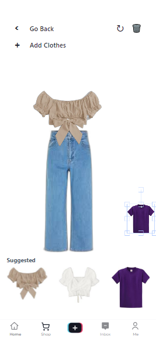

# tiktok-techjam


## [Youtube Link](https://www.youtube.com/watch?v=xS9flWdUzRg)
> [!TIP]
> In this demo, ensure that you are connected to the internet to facilitate the fast download of models.

## Personal Virtual Dressing Room 
*_Problem statement: On enhancing tailored discovery on tiktok shop_*

On the TikTok Shop journey, users often feel overwhelmed by the sheer volume of available options, endlessly scrolling through product pages. MindWave revolutionizes this experience by hyperpersonalizing the search for ideal fashion products.

With MindWave, users can seamlessly add items to their wishlist and later access them in a virtual dressing room. This innovative feature eliminates the need to compare multiple product pages, allowing users to mix and match outfits effortlessly to find their perfect fit.

The virtual dressing room is conveniently accessible via a pop-up button on the 'For You' page when fashion-related ads appear, or from any virtual shop page within TikTok Shop. From the dressing room, users can navigate to their wardrobe page, which consists of two components: clothes they personally own and their wishlist. By integrating these features, MindWave transforms the TikTok Shop experience, providing a tailored, intuitive, and engaging way to discover their ideal fashion products.

## Features Offered

- Users are able to upload pictures of their clothes. This should be done with their clothes placed on a flat surface. With the use of sophisticated Machine Learning models, these images are tagged and the background for the clothes are removed. The use of tagging allows for searchability, while the removal of image backgrounds improves the styling experience. These processed images are then stored in a database and only accessible to the user via the _User Wardrobe_. 

- Likewise, businesses and shops are also able to upload images of clothing items to their very own _Shop Wardrobe_. These images are available to users, who maintain a _User Wishlist_ for styling purposes before purchase.

- The standout feature of MindWave is the _virtual dressing room_, offering users a blank canvas to style themselves. This feature is conveniently accessible via a pop-up button on the 'For You' page when fashion-related ads appear, or from any virtual shop page within TikTok Shop. In the virtual dressing room, users can mix and match outfits effortlessly, combining items from their wardrobe and wishlist to find their perfect fit.

- Lastly, we also offer a _suggestions_ feature, which provides a list of recommended outfits that complement a selected piece of clothing. This feature makes use of colour theory, and our recommendation system looks out for other clothing pieces whose colour palette are similar to the current piece of clothing, or forms its complementary colour palette.

## Running the Project

Create a `.env` file in the root folder using `cp sample.env .env`.
Execute the script:
```shell
./backend/download_CLIP.sh
```
Then run the following command:
```
docker-compose up --build
```

### Frontend
```
cd frontend
npm install
npm run dev
```
> [!NOTE] 
> Ensure that your window size is 432 by 932p

## General Description
> [!NOTE]
> For more details, please refer to our technical documentation under the `docs` folder.

**Technical Stack**

### Frontend

* **React**: Used for building reusable UI components
* **TailwindCSS**: Used for CSS styling and utility-first approach
* **ChakraUI**: Used for UI component library and styling
* **FabricJS**: Used for interactive image rendering and manipulation
* **Vite**: Used for frontend build and development tooling

### Backend

* **FastAPI**: Used for building the RESTful API and handling requests
* **PostgreSQL**: Used as the relational database management system
* **SQLAlchemy**: Used as the ORM (Object-Relational Mapping) tool for interacting with PostgreSQL
* **Rembg**: Used for image background removal
* **Pillow**: Used for image processing and manipulation
* **Transformers**: Used for machine learning tasks such as background removal and image classification

## Datasets and Assets Used
- [Kaggle Fashion Design Dataset](https://www.kaggle.com/datasets/paramaggarwal/fashion-product-images-dataset) (in our demo).
- Lucide: Used for icon pack and SVG components

## API Documentation

Found [here](/docs/api_docs.md)

## Technical Report

Found [here](/docs/README.md)
