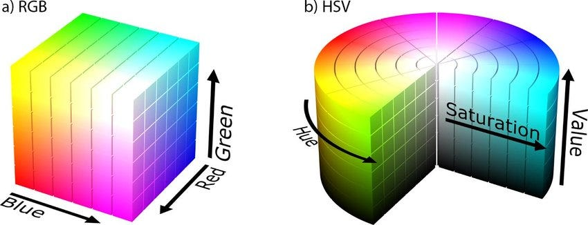

# Technical Documentation: Frontend

# Technical Documentation: Backend Models and Methods

## Rembg

Rembg is a python library which uses machine learning models under the hood to remove the backgrounds of images. This is great for our use case and allows us to remove the backgrounds of clothing images for an enhanced user experience.

## Image Tagging

Image tagging is done using a machine learning model (Fashion-CLIP)[https://huggingface.co/patrickjohncyh/fashion-clip]. Default classes are first defined, and the machine learning model classifies each image by tag.

## Suggestions

Clothing suggestions are done by considering clothing colours from an artistic perspective, which considers colours in harmony with each other on the colour wheel, rather than their RGB values. In other words, clothing recommendations are based on the aesthetic relationships between colours, as seen on the colour wheel, rather than their technical RGB values used for digital displays.

For clothing suggestions, we first consider a _selected_ piece of clothing and compare its colour palette to all _other_ clothing items, before assigning a similarity score for the _other_ pieces of clothing. For _all_ images, we resize the image into a 10 by 10 image to extract the average colours of the image. Then, we extract the dominant colours out of these 100 pixels. 

Then, we convert the rgb values for the dominant colours into hsv values. The reason is that it is (often advised)[https://ivyandpearlboutique.com/blogs/fashion-howto/fashion-colors-matching-clothing-colors-using-color-wheel] to select colours that are complementary or analogous (similar), based on the colour wheel. The hsv conversion provides easy access to colour wheel coordinates.

Source: <https://medium.com/neurosapiens/segmentation-and-classification-with-hsv-8f2406c62b39>

Typically, hues are represented in radians from $0$ to $2\pi$. However, in the `colorsys` module, hues (h) take up a range $h \in [0, 1]$. Similarly, saturation (s) and value (v) take up the same range $s, v \in [0, 1]$. To provide a higher score for _analogous_ or _complementary_ colour palettes, we measure the distance between the _selected_ clothing's dominant hues and the _other_ clothing's dominant hues.

$$D(h_1, h_2) = \min {|h_1 - h_2|, 1 - |h_1 - h_2|}$$

We also do the same for the _selected_ clothing's complement hues, $h^c = h + 0.5$
$$D(h_1^c, h_2) = \min {|h_1^c - h_2|, 1 - |h_1^c - h_2|}$$

We then assign a score based on these distances, assigning a high score to small or medium distances for dominant hues, which allows for similar or analogous hues, and only very small distances for complementary hues, which allows for complementary hues. Lastly, we also take into account the similarity between $s$ and $v$ values and assign higher scores for smaller differences.
